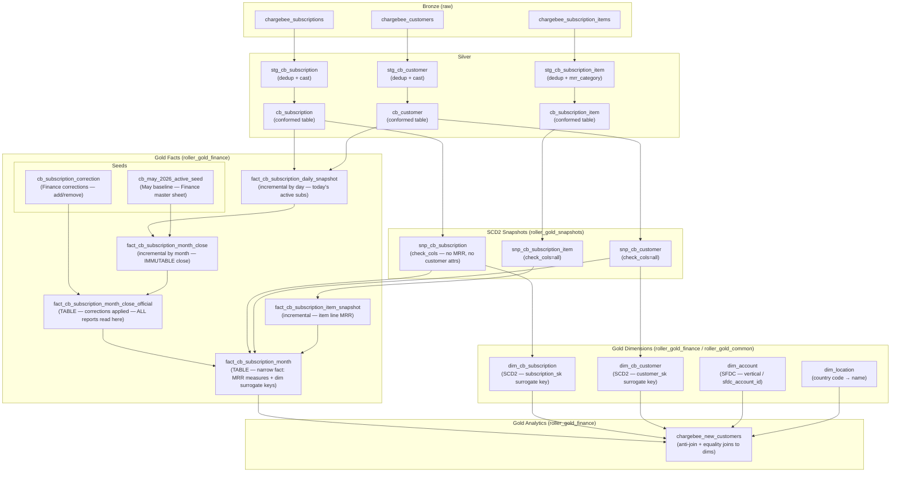
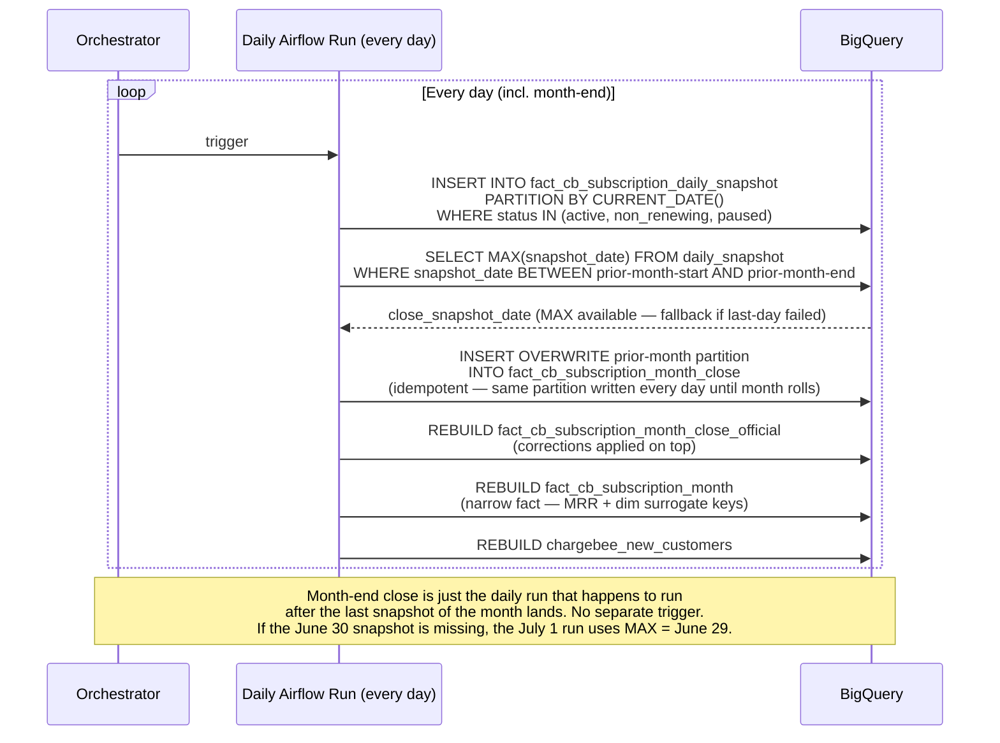
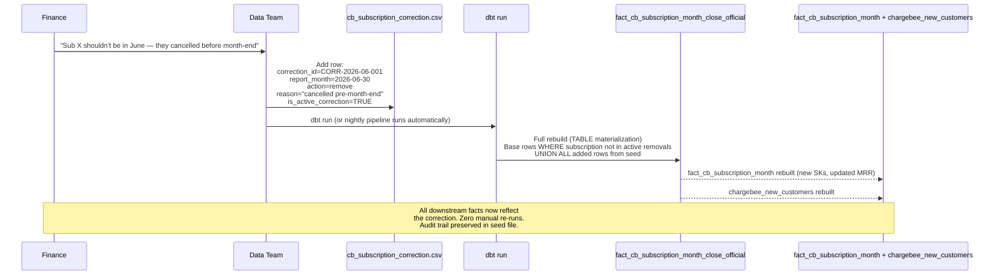

# EDP-147 — Chargebee Modelling: Architecture & Design Walkthrough

**Branch:** `EDP-147-Chargebee-Modelling`  
**Scope:** New monthly close infrastructure, Finance correction layer, Kimball dimensional model, and analytics refactor for all `cb_*` Chargebee models.

---

## 1. Why We Rebuilt This

The original Chargebee stack had three structural problems that would have compounded over time:

| # | Problem | Impact |
|---|---|---|
| **Critical 1** | Customer attributes (billing_country, pod, roller_payments, etc.) stored in `snp_cb_subscription` | Any customer rename triggers false subscription SCD2 rows, inflating history |
| **Critical 2** | `chargebee_mrr_lc` (a measure) included in `check_cols` of the subscription snapshot | Every price change creates an unnecessary new SCD2 version even when nothing else changed |
| **Critical 3** | `chargebee_new_customers.sql` (330 lines, 6 heavy CTEs) doing all SCD2 joins, MRR pivots, and discount calculations inline — nothing reusable | Logic cannot be shared across reports; Finance corrections require manual re-runs in every model |

On top of the structural issues, there was no durable monthly close mechanism. The Finance team relied on a manual Google Sheet for new customer reporting. If the end-of-month job failed, there was no fallback, and Finance corrections had no pathway into the data pipeline.

---

## 2. What Was Fixed (Critical 1 & 2)

### Critical 1 — Customer attributes removed from subscription snapshot

**Files changed:** `models/silver/conformed/cb_subscription.sql`, `snapshots/snp_cb_subscription.sql`

Removed 8 customer columns (`account_guid_bridge`, `billing_country`, `pod`, `customer_segment`, `managed_account`, `roller_payments`, `roller_payments_customer_type`, `book_now_migrated_customer`) from the subscription conformed model and its snapshot.

These now live exclusively in `snp_cb_customer`, exposed as `dim_cb_customer`. Point-in-time customer attributes are fetched by joining `fact_cb_subscription_month` → `dim_cb_customer` on `customer_sk`.

### Critical 2 — MRR measure excluded from SCD2 check_cols

**File changed:** `snapshots/snp_cb_subscription.sql`

Changed `check_cols='all'` to an explicit 20-column list that excludes `chargebee_mrr_lc`. The MRR field is still SELECT-ed (kept for backward compatibility) but price-only changes no longer trigger a new SCD2 row.

```
check_cols = [customer_id, plan_name, status, subscription_start_date,
              billing_cycle, billing_cycle_months, currency_code,
              venue_name, venue_id, venue_unique_identifier,
              tier_roller_payments, tier_api, tier_3rd_party_processing,
              auto_suspend, next_billing_at, activated_at, current_term_start,
              pause_date, resume_date, cancelled_at]
```

---

## 3. New Architecture — Full Picture



---

## 4. Layer-by-Layer Explanation

### 4.1 Silver — Staging & Conformed

| Model | Purpose |
|---|---|
| `stg_cb_*` | Dedup from bronze (ROW_NUMBER on updated_at DESC, resource_version DESC), SAFE_CAST, basic filtering |
| `cb_subscription` | Conformed subscription facts — pure subscription attrs only (no customer cols) |
| `cb_customer` | Conformed customer attrs — company, billing_country, pod, roller_payments flags, SFDC bridge key |
| `cb_subscription_item` | Conformed line items — mrr_category CASE logic, excludes item_type='charge' (one-time) |

### 4.2 SCD2 Snapshots

| Snapshot | Tracks | Notes |
|---|---|---|
| `snp_cb_subscription` | Subscription dim attributes | check_cols explicit list, excludes chargebee_mrr_lc |
| `snp_cb_customer` | Customer attributes | check_cols='all' |
| `snp_cb_subscription_item` | Line item amounts by mrr_category | check_cols='all' |

All snapshots use `hard_deletes='invalidate'` — deleted records get a `dbt_valid_to` set rather than being physically removed.

### 4.3 Daily Snapshot — Resilience Layer

```
fact_cb_subscription_daily_snapshot
  Grain: (subscription_id, source_instance, snapshot_date)
  Partition: snapshot_date (day)
  Materialization: incremental (insert_overwrite)
  Run cadence: daily (every Airflow run)
```

Captures every subscription (status IN active/non_renewing/paused) as of `CURRENT_DATE()`. Filters out HQ/DNU/DUMMY company names.

**Why this exists:** If the month-end job fails on the 30th/31st, the monthly close can fall back to the 29th snapshot automatically — no manual intervention required.

### 4.4 Monthly Close — Immutable Base

```
fact_cb_subscription_month_close
  Grain: (subscription_id, source_instance, month_end_date)
  Partition: month_end_date (month)
  Materialization: incremental (insert_overwrite, full_refresh=false)
  Run cadence: daily (Airflow) — idempotent overwrite of the prior month's partition on every run
  Statuses included: active, non_renewing, paused (NOT filtered to billing-active only)
```

**Why paused subscriptions are included:** A subscription that was paused in month M−1 has `is_active_billing=FALSE`. The new-customer anti-join requires `is_active_billing=TRUE` in the prior month. If that prior row is missing entirely, we cannot distinguish "never seen before" from "was paused". Including paused rows lets the anti-join correctly flag Paused→Active as a new customer.

Close logic:
1. `period` CTE computes `DATE_SUB(DATE_TRUNC(CURRENT_DATE(), MONTH), INTERVAL 1 DAY)` = last day of prior month.
2. `close_date` CTE finds `MAX(snapshot_date)` from the daily snapshot within that month (fallback if last-day job failed).
3. `computed` CTE reads the daily snapshot at that close date.
4. `seed` CTE re-emits the May 2026 seed partition (Finance master sheet baseline — idempotent on every run).
5. `UNION ALL` of computed + seed = final output.

`full_refresh=false` prevents accidental `dbt run --full-refresh` from wiping immutable historical partitions.

`close_snapshot_date` records which daily snapshot was actually used — Finance can always audit which day's data closed a given month.

### 4.5 Finance Correction Layer — Official

```
fact_cb_subscription_month_close_official
  Grain: (subscription_id, source_instance, month_end_date)
  Materialization: TABLE (full rebuild on every run)
  Reads from: fact_cb_subscription_month_close + cb_subscription_correction seed
```

This is the **authoritative monthly-close subscription record**. Every downstream model reads from this — never directly from the base.

Two correction types:
- `action='remove'` — subscription is excluded from the closed month (e.g. Finance reversed a charge)
- `action='add'` — subscription is added to the closed month (e.g. missed in the auto capture)

`is_active_correction=FALSE` revokes a correction without deleting the audit row.

`record_source` column: `'auto'` for system rows, `'finance_correction'` for seed-added rows.

### 4.6 Gold Dimensions — Kimball SCD2

`dim_cb_subscription` and `dim_cb_customer` are proper Kimball SCD2 dimensions. They read from the dbt snapshots, add a surrogate key, and expose all version history. They are wide and have no time grain in their name.

| Dim | Source | Surrogate Key | What It Contains |
|---|---|---|---|
| `dim_cb_subscription` | `snp_cb_subscription` | `subscription_sk` | plan_name, billing_cycle_months, currency_code, venue, tiers, lifecycle dates, status, is_current |
| `dim_cb_customer` | `snp_cb_customer` | `customer_sk` | account_guid_bridge, company, billing_country, pod, roller_payments flags, is_current |

**Surrogate key formula** (same in both dim and fact — equality is guaranteed):
```sql
{{ dbt_utils.generate_surrogate_key(['natural_key_cols', 'dbt_valid_from']) }}
```

**Join patterns:**
```sql
-- Current state (e.g. for SFDC lookups)
WHERE is_current = TRUE

-- Point-in-time (e.g. what was the plan on June 30?)
WHERE dbt_valid_from <= '2026-06-30T23:59:59'
  AND (dbt_valid_to IS NULL OR dbt_valid_to > '2026-06-30T23:59:59')

-- From a fact table (equality join — no temporal join needed downstream)
JOIN dim_cb_subscription AS sm ON fm.subscription_sk = sm.subscription_sk
```

### 4.7 Narrow Monthly Fact — fact_cb_subscription_month

```
fact_cb_subscription_month
  Grain: (subscription_id, source_instance, month_end_date)
  Materialization: TABLE (full rebuild on every run)
  Reads from: fact_cb_subscription_month_close_official (authoritative grain)
              snp_cb_subscription (temporal join — captures subscription_sk + billing_cycle_months)
              snp_cb_customer (temporal join — captures customer_sk)
              fact_cb_subscription_item_snapshot (temporal join — MRR by category)
```

The temporal joins happen **here only** — once, at build time, as a TABLE. Every downstream model gets simple equality joins on the surrogate keys.

Columns:
- **Grain keys:** `month_end_date`, `subscription_id`, `source_instance`, `customer_id`
- **Dim foreign keys:** `subscription_sk` → `dim_cb_subscription`, `customer_sk` → `dim_cb_customer`
- **Status flags:** `status`, `is_active_billing`, `is_deferred_start`, `company`
- **MRR measures:** `chargebee_mrr_lc`, `billing_cycle_months`, `unit_price_lc`, all 7 MRR categories, `total_gross_mrr_lc`, `recurring_discount_lc`, `total_net_mrr_lc`, `discount_pct_of_gross_mrr`
- **Non-MRR addons:** `rp_sim_fees_lc`, `rp_terminal_rental_lc`, `rp_terminal_rental_quantity`, `implementation_instalment_lc`

### 4.8 MRR Calculation

MRR categories (from `stg_cb_subscription_item.mrr_category`):

| Category | Counts toward gross MRR? |
|---|---|
| platform_plan | Yes |
| gxs | Yes |
| api | Yes |
| waivers | Yes |
| hq | Yes |
| volare | Yes |
| other | Yes |
| rp_sim_fees | No — non-MRR addon |
| rp_terminal_rental | No — non-MRR addon |
| implementation_instalment | No — non-MRR addon |

Key formulas:

```
platform_plan_mrr_lc   = ROUND(platform_plan_lc_raw  / billing_cycle_months, 2)
total_gross_mrr_lc     = SUM of all 7 MRR categories ÷ billing_cycle_months
recurring_discount_lc  = ABS(chargebee_mrr_lc − all_items_sum_raw / billing_cycle_months)
total_net_mrr_lc       = total_gross_mrr_lc − recurring_discount_lc
discount_pct_of_gross  = recurring_discount_lc / total_gross_mrr_lc × 100
```

`chargebee_mrr_lc` is Chargebee's own pre-calculated MRR (locked from the official layer) and serves as the **single authoritative net MRR baseline**. It is never derived from item amounts.

### 4.9 Analytics — chargebee_new_customers (Refactored)

**Before:** 330 lines, 6 heavy CTEs performing SCD2 joins and MRR pivot inline.

**After:** ~160 lines — anti-join only, then all equality joins.

```sql
-- Anti-join: billing-active in current month, not in prior month
FROM fact_cb_subscription_month_close_official AS curr
LEFT JOIN fact_cb_subscription_month_close_official AS prev
    ON curr.subscription_id = prev.subscription_id
   AND curr.source_instance = prev.source_instance
   AND prev.month_end_date = DATE_SUB(DATE_TRUNC(curr.month_end_date, MONTH), INTERVAL 1 DAY)
   AND prev.is_active_billing = TRUE
WHERE curr.is_active_billing = TRUE
  AND prev.subscription_id IS NULL
  AND curr.month_end_date > DATE '2026-05-31'   -- baseline month is reference, not a reporting month
```

Then equality joins only:
- `fact_cb_subscription_month` — MRR measures + surrogate keys (grain join)
- `dim_cb_subscription` ON `subscription_sk` — plan name, billing cycle, venue, dates, tiers
- `dim_cb_customer` ON `customer_sk` — SFDC bridge key, billing country, pod, roller_payments
- `dim_account` — Finance vertical (experience_category + sub_vertical)
- `dim_location` — country code → full name

No temporal joins anywhere in the analytics layer. All temporal logic is pre-computed inside `fact_cb_subscription_month`.

---

## 5. Monthly Close Flow



---

## 6. Finance Correction Cascade



**Revoking a correction** (without deleting): set `is_active_correction=FALSE` in the seed row. The next dbt run will restore the original auto-generated row.

---

## 7. New Customer Detection — Business Logic

A subscription is **new** in month M if:
1. It is billing-active (`is_active_billing = TRUE`) in month M
2. It was NOT billing-active in month M−1

`is_active_billing = TRUE` when `status IN ('active', 'non_renewing')`.
`is_active_billing = FALSE` when `status = 'paused'` — so **Paused → Active** counts as new (the prior month join returns NULL).

**Baseline month:** May 2026 (`cb_may_2026_active_seed`) is the reference set for the June anti-join. It is NOT a reporting month — the model filters `month_end_date > DATE '2026-05-31'` to exclude it from the output.

**Deferred start flag:** `is_deferred_start = TRUE` when the billing start date (`subscription_start_date` / `cf_billing_start_date`) and `current_term_start` are both in a **later** calendar month than `activated_at`. US subscriptions use the raw activation date; non-US adds 1 day for UTC offset.

```
-- US logic
is_deferred_start = (
    DATE_TRUNC(subscription_start_date, MONTH) > DATE_TRUNC(DATE(activated_at), MONTH)
    AND
    DATE_TRUNC(DATE(current_term_start), MONTH) > DATE_TRUNC(DATE(activated_at), MONTH)
)

-- Non-US (UTC+1 offset)
is_deferred_start = (
    DATE_TRUNC(subscription_start_date, MONTH) > DATE_TRUNC(DATE_ADD(DATE(activated_at), INTERVAL 1 DAY), MONTH)
    AND
    DATE_TRUNC(DATE(current_term_start), MONTH) > DATE_TRUNC(DATE_ADD(DATE(activated_at), INTERVAL 1 DAY), MONTH)
)
```

---

## 8. Files Changed / Created

### Modified

| File | Change |
|---|---|
| `models/silver/conformed/cb_subscription.sql` | Removed 8 customer columns (Critical 1) |
| `snapshots/snp_cb_subscription.sql` | Removed customer columns; changed check_cols to explicit list excluding chargebee_mrr_lc (Critical 2) |
| `models/gold/facts/finance/fact_cb_subscription_month_close.sql` | Full rewrite — new close logic with daily snapshot fallback + seed union |
| `models/gold/analytics/finance/chargebee_new_customers.sql` | Refactored — anti-join on close_official; equality joins to fact_cb_subscription_month + dims |
| `models/gold/facts/finance/schema.yml` | Updated — documents new models, removes retired entries |
| `models/gold/dimensions/finance/schema.yml` | New — documents dim_cb_subscription and dim_cb_customer |
| `seeds/finance/schema.yml` | Added full documentation for cb_subscription_correction seed |
| `dbt_project.yml` | Added cb_subscription_correction seed column types |

### New

| File | Purpose |
|---|---|
| `models/gold/facts/finance/fact_cb_subscription_daily_snapshot.sql` | Daily active-sub snapshot (resilience layer) |
| `models/gold/facts/finance/fact_cb_subscription_month_close_official.sql` | Authoritative monthly close with correction overlay |
| `models/gold/facts/finance/fact_cb_subscription_month.sql` | Narrow monthly fact — MRR measures + dim surrogate keys |
| `models/gold/dimensions/finance/dim_cb_subscription.sql` | SCD2 subscription dimension (subscription_sk) |
| `models/gold/dimensions/finance/dim_cb_customer.sql` | SCD2 customer dimension (customer_sk) |
| `seeds/finance/cb_subscription_correction.csv` | Finance correction rows (headers-only — data team manages) |

### Deleted

| File | Reason |
|---|---|
| `models/gold/facts/finance/fact_cb_subscription_mrr_month.sql` | Absorbed into fact_cb_subscription_month |

---

## 9. Materialization Strategy Summary

| Model | Strategy | Why |
|---|---|---|
| `fact_cb_subscription_daily_snapshot` | Incremental, insert_overwrite by day | Accumulates daily history; idempotent re-run |
| `fact_cb_subscription_month_close` | Incremental, insert_overwrite by month, full_refresh=false | Daily Airflow — idempotent overwrite of prior-month partition; `full_refresh=false` protects historical partitions |
| `fact_cb_subscription_month_close_official` | TABLE | Full rebuild guarantees corrections always cascade |
| `dim_cb_subscription` | TABLE | Rebuilt daily from snapshot; always reflects latest SCD2 history |
| `dim_cb_customer` | TABLE | Rebuilt daily from snapshot; always reflects latest SCD2 history |
| `fact_cb_subscription_month` | TABLE | Must reflect latest corrections and latest dim SK assignments on every run |
| `chargebee_new_customers` | TABLE | Must reflect latest corrections on every run |

**Key rule:** Everything downstream of the official layer is a TABLE. A correction in the seed file propagates to `chargebee_new_customers` in a single `dbt run` with no additional flags or manual steps.

---

## 10. Run Order (DAG)

```
Bronze
  └─ Silver Staging (views)
       └─ Silver Conformed (tables)
            ├─ SCD2 Snapshots (daily)
            │    ├─ snp_cb_subscription ──────────────────────────────────────────── dim_cb_subscription (table)
            │    ├─ snp_cb_customer ──────────────────────────────────────────────── dim_cb_customer (table)
            │    └─ snp_cb_subscription_item
            │         └─ fact_cb_subscription_item_snapshot (incremental)
            │
            ├─ fact_cb_subscription_daily_snapshot (incremental — daily)
            │    └─ fact_cb_subscription_month_close (incremental — prior-month close, idempotent daily)
            │         └─ fact_cb_subscription_month_close_official (table — corrections)
            │              └─ fact_cb_subscription_month (table — narrow fact, MRR + dim SKs)
            │                   └─ chargebee_new_customers (table)
            │
            └─ [seeds: cb_may_2026_active_seed, cb_subscription_correction]
```

Note: `dim_cb_subscription` and `dim_cb_customer` are inputs to `chargebee_new_customers` (via equality join on SK from `fact_cb_subscription_month`).

---

## 11. What's Deferred

| Item | Status | Reason |
|---|---|---|
| AUD/USD conversion columns (`*_aud`) | NULL placeholders in chargebee_new_customers | FX rate table approach not confirmed |
| `sales_pipeline` column | NULL placeholder | Requires SFDC opportunity join via account_guid_bridge (pending Abhishek confirmation) |
| `customer_segment`, `managed_account` attrs | Not in snp_cb_customer | Can be added to the snapshot when needed |
| EMEA/APAC historical monthly closes pre-June 2026 | Not modelled | No daily snapshots exist for prior months; requires seed files similar to cb_may_2026_active_seed |

---

## 12. How to Apply a Finance Correction (Runbook)

1. Open `seeds/finance/cb_subscription_correction.csv`
2. Add a new row following the format:

```
correction_id,report_month,subscription_id,source_instance,action,is_active_correction,reason,applied_by,...
CORR-2026-06-001,2026-06-30,SUB_XYZ,us,remove,TRUE,"Cancelled before month-end — Finance confirmed",sridhar.iyer@rollerdigital.com,,,,,,
```

3. For `action='add'` also fill in: `customer_id`, `status`, `chargebee_mrr_lc`, `company`, `is_active_billing`, `is_deferred_start`
4. Commit the seed file
5. Run `dbt run` (or let the nightly pipeline run)
6. All downstream facts and analytics rebuild automatically

**To revoke a correction:** set `is_active_correction=FALSE` — the audit row is preserved, the correction is unapplied on the next run.

---

## 13. What Was Wrong with the Original Design

This section documents the original architectural mistakes so the reasoning behind the rebuild is clear.

### 13.1 Snapshots Acting as Dimensions — No Proper Dim Layer

**The problem:** The original design had no Gold dimension models for Chargebee at all. `snp_cb_subscription` and `snp_cb_customer` were used directly as substitutes for dimension tables. Analytics models (`chargebee_new_customers`) joined straight to the snapshot tables using temporal join predicates (`dbt_valid_from <= X AND (dbt_valid_to IS NULL OR dbt_valid_to > X)`).

**Why this was wrong:**
- Snapshots are raw append-only history tables. They are not consumption-ready. Every downstream model that needed subscription or customer attributes had to re-implement the same temporal join logic from scratch.
- The temporal join pattern is fragile — one missing `OR dbt_valid_to IS NULL` guard, or a timestamp boundary off by a second, produces incorrect point-in-time results silently.
- No surrogate keys existed on the snapshots, so every join was a compound multi-column join: `subscription_id + source_instance + dbt_valid_from <= X AND (dbt_valid_to IS NULL OR dbt_valid_to > X)`. This is expensive in BigQuery and error-prone to repeat.
- The pattern did not scale: every new analytics model that needed subscription or customer attributes had to repeat the temporal join boilerplate — no reuse possible.

**The fix:** Proper Kimball SCD2 dimension tables (`dim_cb_subscription`, `dim_cb_customer`) were added. These are TABLE-materialized wrappers over the snapshots. They add a surrogate key (`subscription_sk`, `customer_sk`) generated from `generate_surrogate_key(['natural_key', 'source_instance', 'dbt_valid_from'])`. The temporal join now happens exactly once — inside `fact_cb_subscription_month` — and downstream models use a plain equality join on the surrogate key.

### 13.2 Intermediate Tables Misnamed as Facts and Dims

**The problem:** Three intermediate tables were created with incorrect names that violated Kimball conventions:

| Original Name | Materialization | What It Actually Was | Why Wrong |
|---|---|---|---|
| `fact_cb_subscription_month` | VIEW | A table of subscription attributes at month-end | No measures; an attributes table, not a fact |
| `fact_cb_customer_month` | VIEW | A table of customer attributes at month-end | No measures; a denorm of customer attrs |
| `fact_cb_subscription_mrr_month` | VIEW | A table of MRR amounts per subscription per month | Measures without surrogate keys — still required temporal joins downstream |

These tables were all named `fact_*` but `fact_cb_subscription_month` and `fact_cb_customer_month` contained no measures whatsoever — they were closer to dimension snapshots. `fact_cb_subscription_mrr_month` had measures but still required temporal joins to get subscription and customer attributes, making it unusable as a clean standalone fact.

Two of the models were also materialized as **VIEW** — which is incorrect for dimensional models. Dimensions must be TABLE so joins are not re-executing snapshot scans on every query.

**The fix:** All three were retired. `dim_cb_subscription` and `dim_cb_customer` absorb the attribute content as proper wide dims. A new narrow `fact_cb_subscription_month` (TABLE) absorbs the MRR measures and adds surrogate key columns so all downstream joins are equality joins. The time grain was removed from the dimension names — a dimension is not "for a month". Dimensions span all time; a surrogate key identifies which version is relevant for a given point in time.

### 13.3 Customer Attributes Mixed into the Subscription Snapshot

**The problem:** Eight customer-level columns (e.g. `billing_country`, `pod`, `roller_payments`, `account_guid_bridge`) were stored in `snp_cb_subscription` and its upstream conformed model. These are attributes of the **customer**, not the subscription.

**Why this was wrong:**
- Every time a customer attribute changed (e.g. the pod team was reassigned), a new SCD2 row was created in the subscription snapshot — even when nothing about the subscription itself changed. This inflated subscription version history with phantom rows.
- It made it impossible to do a clean point-in-time customer join, because customer attributes were already baked into subscription rows at the wrong granularity.
- Customer attributes could not be tracked independently for non-subscription analytics (e.g. customer-level churn or pod-level reporting).

**The fix:** Customer columns were removed from `cb_subscription.sql` and `snp_cb_subscription`. They now live exclusively in `snp_cb_customer` → `dim_cb_customer`. Point-in-time customer attributes are retrieved via the `customer_sk` foreign key from `fact_cb_subscription_month`.

### 13.4 MRR Included in Snapshot check_cols

**The problem:** `snp_cb_subscription` used `check_cols='all'`, which included `chargebee_mrr_lc` (a measure). This meant every price change in Chargebee triggered a new SCD2 row in the subscription snapshot, even when no subscription attribute (plan, billing cycle, venue, tier, etc.) changed.

**Why this was wrong:**
- Measures do not belong in `check_cols`. SCD2 is for tracking **attribute changes**, not metric changes.
- Every price correction in Chargebee (rounding adjustments, promo codes, etc.) created a new subscription version row in the history, making the SCD2 history noisy and misleading.
- It made point-in-time joins more expensive — more rows to evaluate for the temporal predicate.

**The fix:** `chargebee_mrr_lc` was removed from `check_cols`. An explicit 20-column list was provided instead. Price changes no longer generate new SCD2 rows. The MRR field is still SELECT-ed from the snapshot for backward compatibility but does not drive versioning.

### 13.5 Temporal Join Logic Duplicated Across Analytics Models

**The problem:** Because there were no dims and no surrogate keys, every analytics model that needed subscription or customer attributes had to write the full temporal join inline — `dbt_valid_from <= point_in_time AND (dbt_valid_to IS NULL OR dbt_valid_to > point_in_time)`. This logic appeared in multiple places and any model joining incorrectly (wrong timestamp, missing NULL guard) would silently produce wrong results.

**The fix:** All temporal joins are now encapsulated inside `fact_cb_subscription_month` only. The model resolves the correct SCD2 version at month-end and writes `subscription_sk` and `customer_sk` into its output. Downstream models join on those surrogate keys with a simple `ON fact.subscription_sk = dim_cb_subscription.subscription_sk` — no temporal logic required anywhere else.

---

### Summary of Design Errors and Fixes

| # | Original Problem | Severity | Fix |
|---|---|---|---|
| 1 | No Gold dims — snapshots used directly as dims in analytics | Critical | Added `dim_cb_subscription` + `dim_cb_customer` (TABLE, SCD2, surrogate keys) |
| 2 | Intermediate tables misnamed as `fact_*` — no measures, wrong materialization | High | Retired 3 models; replaced with proper wide dims + narrow fact |
| 3 | Customer attributes stored in subscription snapshot (wrong grain) | Critical | Removed from subscription conformed + snapshot; moved to `snp_cb_customer` → `dim_cb_customer` |
| 4 | MRR measure in snapshot `check_cols` (triggers wrong SCD2 versions) | High | Removed from check_cols; explicit column list used instead |
| 5 | Temporal join logic duplicated in every analytics model | Medium | Encapsulated once in `fact_cb_subscription_month`; downstream uses equality joins on surrogate keys |
